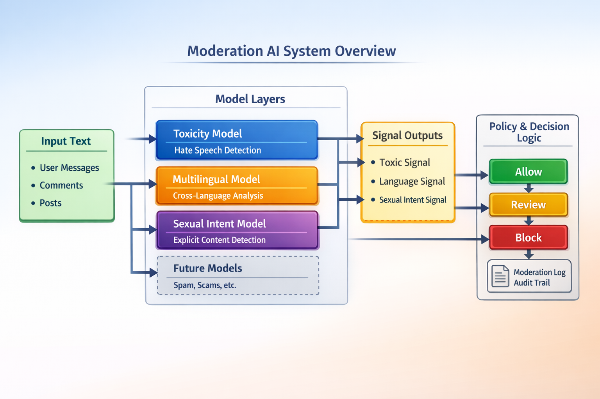

## This project is an AI-based text moderation system built for a global asynchronous search platform.

The platform works as a worldwide search engine and data system, where users can publish and search information across countries, languages, and regions. Because the system is global, content moderation is critical.

This moderation service is designed to be scalable, multilingual, production-ready, and model-driven. It is not a single ML model, but a moderation system composed of multiple models, each solving a specific task.

## Why This System Exists

Global platforms face real problems such as toxic language, hate speech, sexual intent and solicitation, threats and violence, spam and scam content, and many languages beyond English. A single model cannot handle all of this reliably.

This project solves the problem by combining multiple models with a policy layer that makes final decisions.

## System Architecture

The system is built as a modular AI service:

API Layer (FastAPI): receives text from the platform and returns moderation decisions (allow, review, block)

Model States: each model is loaded independently and can be replaced or disabled without breaking the system

Policy Layer: combines signals from all models and makes the final decision

## Models Inside the System

v1 — Base Toxicity Model
English-focused model that detects toxicity, hate, sexual content, violence, spam, and scam. It is trained using neural networks (Keras) and uses calibrated thresholds.

v2 — Multilingual Toxicity Model
Works across multiple languages and detects general toxicity where v1 may be weak. It is used as confirmation and false-positive protection. It does not blindly block content and only escalates decisions.

v3 — Sexual Intent Detection (WEST group)
Covers EN, DE, FR, ES, and NL languages. Detects sexual intent and solicitation using TF-IDF and Logistic Regression. This model never blocks content directly and is used only as a signal to help distinguish flirting from explicit intent or harassment.

## Policy Logic

The system does not trust models blindly. All decisions are handled by the policy layer:

    v1 detects strong aggression signals

    v2 confirms or rejects them

    v3 adds contextual sexual intent signals

The final decision is made: allow, review, or block

This approach reduces false positives, keeps human review where needed, and is safe for production use.

## Why This Is Not a Toy Project

This project demonstrates real ML system architecture, multi-model orchestration, threshold calibration, multilingual strategy, and production-style API design. It is much closer to real ML Engineering work than to a single standalone ML model.

## Deployment

The system is designed to run as an independent service, deployable with Docker, and easily connected to a larger platform. All trained models, tokenizers, and thresholds are stored in the artifacts/ directory and loaded at runtime.

## Target Platform

This moderation system is built for integration with findway.pro — a global asynchronous search and data platform. The service protects the platform, users, and data quality at scale.

## Future Plans

Planned improvements include adding more language groups (PL, CZ, SK, LT, etc.), image moderation, better datasets and retraining pipelines, extended policy logic with feedback loops, and full production monitoring.

## Author

Built as a long-term production system, not a demo. Designed with scalability, safety, and real-world use in mind.
