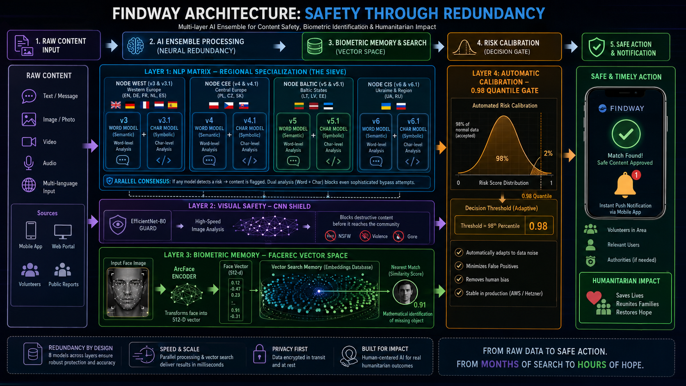

Ensemble Architecture: 8 Models Operating as One Distributed Safety System

FindWay moderation is not based on a single “intelligent” AI model.
The system was intentionally designed as a distributed ensemble architecture where multiple lightweight models collaborate through a centralized policy and calibration layer.
https://nenashev.net/en/portfolio

Instead of relying on one monolithic neural network, the platform uses 8 specialized moderation models organized into four regional language zones:

CIS (Ukrainian / Russian)
Central Europe
Baltic Region
Western Europe

Each regional zone contains two complementary models operating in parallel:

Semantic Model (Word-Level Analysis)

The first model focuses on:

contextual understanding
semantic meaning
intent detection
behavioral interpretation

It evaluates whether the message carries harmful, manipulative, or dangerous intent even when written in relatively “clean” language.

Symbolic / Obfuscation Model (Character-Level Analysis)

The second model is optimized for adversarial text patterns and bypass attempts.

It detects:

character substitutions (a → @, o → 0)
fragmented words
hidden insults
symbolic masking
spam obfuscation
deliberately corrupted language

This layer was specifically designed to handle real-world abuse scenarios where users intentionally try to bypass moderation systems.

Parallel Consensus Instead of Blind AI Decisions

In FindWay, no individual model acts as the final authority.

All moderation outputs are collected by a centralized policy decision layer which evaluates:

combined risk scores
model agreement
regional context
confidence thresholds
operational safety rules

The final moderation status is determined through strict business logic:

✅ Approved
⚠ Pending Review
⛔ Blocked

This architecture avoids the common industry mistake of treating AI as “magic.”

The platform does not blindly trust one neural network prediction.
Instead, AI functions as a probabilistic signal system operating under controlled policy governance.

Real-Time Adaptive Thresholding

One of the core priorities of the system is minimizing false positives.

If the confidence score remains below a critical risk threshold, the platform intentionally prefers:

user continuity over aggressive blocking.

Because the moderation models are lightweight and modular, thresholds can be recalibrated dynamically in production without retraining the entire ensemble.

For example:

sudden spam waves
regional abuse campaigns
coordinated bypass attacks

can be mitigated through live threshold adjustments and policy adaptation.

This allows the platform to remain operationally flexible while preserving moderation stability under changing conditions.

Designed for Distributed, High-Load Environments

The moderation pipeline was built for asynchronous distributed systems where:

inference speed
fault tolerance
scalability
operational resilience

are more important than isolated benchmark accuracy.

The architecture integrates directly into the FindWay ecosystem through:

asynchronous processing queues
Rails orchestration services
AI microservices
vector similarity infrastructure
policy-based moderation routing

This enables the system to process multilingual user-generated content in real time while maintaining stable behavior under production load.

Safety Through Redundancy

The core philosophy behind the system is simple:

reliability emerges from coordinated specialization, not from one oversized model.

Instead of building one fragile “super-AI,”
FindWay uses distributed intelligence, layered moderation logic, and adaptive calibration mechanisms to achieve resilient and explainable content safety.
